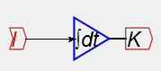
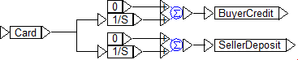
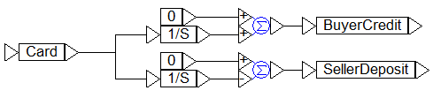

## Introduction

### New to system dynamics?}

Minsky is one of a family of `system dynamics` computer
programs. These programs allow a dynamic model to be constructed, not
by writing mathematical equations or numerous lines of computer code,
but by laying out a model of a system in a block diagram, which can then
simulate the system. These programs are now the main tool used by
engineers to design complex products, ranging from small electrical
components right up to passenger jets.

Minsky adds another means to create the dynamic equations that are
needed to define monetary flows---the `Godley Table`---which is
discussed in the next help topic for users who are experienced in
system dynamics. In this section, we'll give you a quick overview of
the generic system dynamics approach to building a model.

Though they differ in appearance, they all work the same way:
variables in a set of equations are linked by wires to mathematical
operators. What would otherwise be a long list of equations is
converted into a block diagram, and the block diagram makes the causal chain
in the equations explicit and visually obvious.

For example, say you wanted to define the rate of employment as
depending on output (GDP), labor productivity and population. Then you
could define a set of equations in a suitable program (like Mathcad):

*TODO: equation example*

Or you could define it using a block diagram, using a program like Vissim:

For a simple algebraic equation like this, modern computer algebra
programs like Mathcad are just as good as a block diagram program like
Vissim. But the visual metaphor excels when you want to describe a
complex causal chain.

These causal chains always involve a relationship between stocks and
flows. Economists normally model stocks and flows by adding an
increment to a stock. For example, the level of Capital is defined as
a difference equation, where capital in year $t$ is shown as being
capital in year $t-1$ plus the investment that took place that year:

*TODO: equation example*

The problem with this approach is that capital is accumulating on a daily,
or even hourly, basis. It is better to model stock as continuous quantities
and for this reason, all stocks and flows in Minsky are handled instead
as integral equations. The amount of capital at time $t$ is shown as
the integral of net investment between time 0 and today:

*TODO: equation example*

However, rather than being shown as an equation, the relationship is shown as a diagram:

The advantages of the block diagram representation of dynamic equations
over a list of equations are:

They make the causal relationships in a complex model
obvious. It takes a specialized mind to be able to see the causal
relations in a large set of mathematical equations; the same
equations laid out as diagrams can be read by anyone who can read
a stock and flow diagram---and that's most of us;

The block diagram paradigm makes it possible to store components of
a complex block diagram in a group. For example, the fuel delivery
system in a car can be treated as one group, the engine as another,
the exhaust as yet another. This reduces visual complexity and also
makes it possible for different components of a complex model to be
designed by different groups and then ``wired together'' at a later
stage.

For example, here's a model of a 4 cylinder engine car---one of the
simple examples distributed with the program Vissim:

Programs like Vissim and Simulink have been in existence for almost 2
decades, and they are now mature products that provide everything
their user-base of engineers want for modeling and analyzing complex
dynamic systems. \htmlref{So why has Minsky been
  developed?}{intro:experienced}

### Experienced in system dynamics?

As an experienced system dynamics user (or if you've just read `New to
system dynamics?`, what you need to know is what Minsky
provides that other system dynamics programs don't. That boils down to
one feature: The Godley Table that enables a dynamic model of
financial flows to be derived from a table that is very similar to the
accountant's double-entry bookkeeping table.

The dynamics in financial flows could be modeled using the block diagram
paradigm. But it would also be very, very easy to make a mistake
modeling financial flows in such a system, for one simple reason:
every financial flow needs to be entered at least twice in a
system---once as a source, and once as a sink.

For example, if you go shopping and buy a new computer with your
credit card, you increase your debt to a bank and simultaneously
increase the deposit account of the retailer from whom you buy the
computer. The two system states in this model--your credit card
(`BuyerCredit`) and the retailer's deposit account
(`SellerDeposit`)---therefore have to have the same entry (let's call
this `Card`) made into them. In Vissim, such a transaction would look
like this:

That would work, but there's nothing in the program that warns you if
you make a mistake like, for example, wiring up the `BuyerCredit` entry,
but forgetting the `SellerDeposit` one:

Or, perhaps, wiring up both blocks, but giving one the wrong sign:

In a very complex model, you might make a mistake like one of the above, run the simulation and get nonsense results, and yet be unable to locate your mistake.

Minsky avoids this problem by using the paradigm that accountants
developed half a millennium ago to keep financial accounts accurately:
double-entry bookkeeping. Here is the same model in Minsky:

This is an inherently better way to generate a dynamic model of financial flows, for at least two reasons:

All financial transactions are flows between entities. The
tabular layout captures this in a very natural way: each row shows
where a flow originates, and where it ends up

The program adopts the accounting practice of double-entry
bookkeeping, in which entries on each row sum to zero. The source is
shown as a `$+$`, the sink is shown as a `$-$`, and assets are shown
as a positive sum while liabilities are shown as a negative. If you
don't ensure that each flow starts somewhere and ends
somewhere---say you make the same mistake as in the block diagram
examples above, then the program will identify your mistake.

If you forget to enter the recipient in this transaction, then the Row
Sum identifies your mistake by showing that the row sums to ``Card''
rather than zero:

And it also identifies if you give the wrong sign to one entry:

\begin{center}

\end{center}

Minsky thus adds an element to the system dynamics toolkit which is
fundamental for modeling the monetary flows that are an intrinsic
aspect of a market economy. Future releases will dramatically extend
this capability.

