# Minsky

Dynamic flow systems program to simulate economic flows (ie. complex system dynamics).
For a full overview, please see the [Introduction](Introduction.md)

- [File Structure](File Structure.md) for an overview of folders and files
- [Architecture](Architecture.md) for an overview of the app and DAG engine

## Getting Started

## System requirements
Minsky is an open source program available for:
- Windows
- Mac OS X,
- various Linux distributions

Also compilable on any suitable Posix compliant system.
Go to our [SourceForge](http://minsky.sf.net) to download a version

Linux packages are available from the [OpenSUSE build service]
(https://build.opensuse.org/package/show/home:hpcoder1/minsky)

-  [Changelog](Changelog.md) for latest changes (new features, bug fixes etc)
-  [Roadmap](Roadmap.md) for our plans for new features, changes etc

## Getting help
Press the F1 key, or select ``help'' from the context menu. Help is
context-sensitive.

### Components of the Program
There are 6 components to the Minsky interface

*menus*

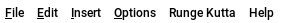

*Run buttons*

*simulation speed slider*

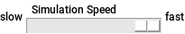

*Zoom buttons*

*Wiring and Equation tabs*

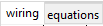

*Design icons*

*Design Canvas*

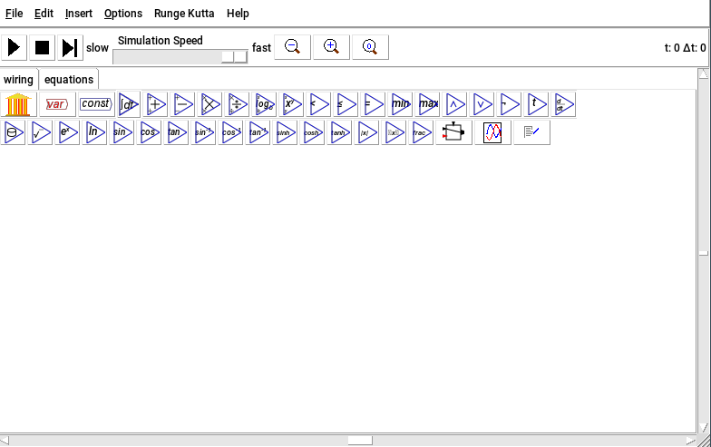

## Menu

The menu controls the basic functions of saving and loading files,
default settings for the program, etc. These will alter as the program
is developed; the current menu items (as at August 2016 release) are:

### File
- `About Minsky` Tells you the version of Minsky that you are using.
- `New System` Clear the design canvas.
- `Open` Open an existing Minsky `mky` file
- `Recent Files` list previously opened Minsky files.
- `Library` Open a repository of models for the Minsky simulation system.
- `Save` Save the current file.
- `Save As` Save the current file under a new name.
- `Insert File as Group` Insert a Minsky file directly into the
current model as a group

`Output LaTeX` Produce the set of equations that define the
current system for use in documenting the model, for use in LaTeX
compatible typesetting systems. If your LaTeX implemention doesn't
support `breqn`, untick the `wrap long equations
option`, which can be found in the preferences panel under the options menu.

`Output MatLab` Output a MatLab function that can be used to
simulate the system in a MatLab compatible system, such as
[MatLab](https://en.wikipedia.org/wiki/MATLAB)
or [Octave](http://www.gnu.org/software/octave/)

`Log simulation` Outputs the results of the integration variables
into a CSV data file for later use in spreadsheets or plotting
applications.

`Recording` Record the mouse movements and keystrokes for later
replay. This is useful for demonstrating how to build a model, but
bear in mind that recorded logs are not, in general, portable between
versions of Minsky.

`Replay recording` Replay a recording of mouse and keystroke events.

`Quit` Exit the program. Minsky will check to see whether you have saved your changes. If you have, you will exit the program; if not, you will get a reminder to save your changes.

`Debugging use` Items under the line are intended for developer
  use, and will not be documented here. Redraw may be useful if the
  screen gets messed up because of a bug.

### Edit
`edit:undo` `Undo` and `Redo` allow you to step back and forward in your editing history. If you step back a few steps, and then edit the model, all
subsequent model states will be erased from the history.

`edit:copy` `Cut/copy/paste`. Selecting, or lassoing a region
of the canvas will select a group of icons, which will be shaded to
indicate the selected items. Wires joining two selected items will
also be selected. Note that, compatible with X-windows, selecting
automatically performs a copy, so the copy operation is strictly
redundant, but provided for users familiar with systems where an
explicit copy request is required.

Cut deletes the selected items.

Paste will paste the items in the clipboard as a
`group` into the current model.

At the time of writing, copy-pasting between different instances of Minsky, or into other applications, may not work on certain systems. Pasting the clipboard
into a text-based application will be a Minsky schema XML document.

<table>
<tr>
<td>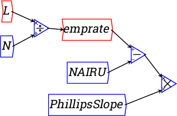</td>
<td><big>&#x21d2;</big></td>
<td>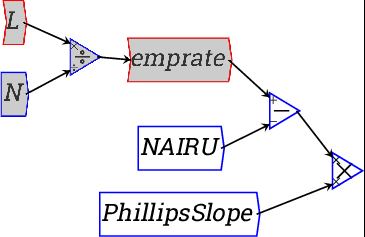</td>
</tr>
</table>

`edit:group` Create a `group` using the
contents of the selection. Groups allow you to organise a more
complicated systems specification into higher level modules that make
the overall system more comprehensible.

### Insert
This menu contains a set of `operations` for placement on the Canvas. You can get the same effect by clicking on the `Design Icons`. Also present are entries for `godley` and `Plot`.

### Options
The options menu allows you to customise aspects of Minsky.

#### Preferences
Godley table double entry. Applies double entry book keeping
semantics to the Godley table, where assets and liabilites have
opposite mathematical meaning. See the \htmlref{Godley table
section}{godley} for more details. Unchecking this option reverts to a
simpler mode where each stock (Godley table column) is treated the
same.

Godley table show values. When ticked, the values of flow
variables are displayed in the Godley table whilst a simulation is
running. This will tend to slow down the simulation somewhat.

Godley table output style, whether `$+/-$` or `DR/CR` (debit/credit)
indicators are used.

Number of recent files to display --- affects the `recentfiles` menu.

`wrap-equations` Wrap long equations in LaTeX export. If ticked, use the breqn
package to produce nicer looking automatically line-wrapped
formulae. Because not all LaTeX implementations are guaranteed to
support breqn, untick this option is you find difficulty.

`Background colour` select a colour from which a colour scheme
is computed.

### Runge Kutta
Controls aspect of the adaptive Runge-Kutta equation solver, which
trade off performance and accuracy of the model.

Note a first order explicit solver is the classic Jacobi method, which is the fastest,
but least accurate solver.

The algorithm is adaptive, so will vary the
step size according to how stiff the system of equations
is.

Specifying a minimum step size prevents the system from stalling,
at the expense of accuracy when the step size reaches that
minimum.

Specifying a maximum step size is useful to ensure one has
sufficient data points for smooth plots.

An iteration is the time between updates of the screen, increasing the
number of solver steps per iteration decreases the overhead involved
in updating the display, at the expense of smoothness of the plots.

### Help
Provides an in-program link to this manual.

### Run Buttons

- `Start simulation` when started the button changes to a pause icon,
allowing you to pause the simulation .
- `Stop simulation` and reset the simulation time to zero
- `Step through simulation` one iteration at a time.

#### Manipulating items on the canvas
- `To move` and item, click on the interior of an item and drag it
to the new position.
- `To wire items` click on the small circle representing the output
port, and drag out a wire towards an input port on another item.
- `To lasso`, click outside of any item and drag out a rectangular
region.
- `To pan` the canvas, hold the shift key down whilst dragging on
the canvas.

`Wire` This draws wires that connect one operator on the Canvas
to another. For example, if you have placed these icons on the

*Palette*
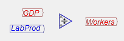

and you now want to link them together into an equation, then click on
the `Wire` button, move the cursor to the right end of `GDP`, and click
and drag to the top of the divide symbol:

Do the same for `LabProd`, and to attach the `Divide` icon to the left
hand side of `Workers`, and you've defined the equation that the number
of workers employed equals GDP divided by labor productivity. The
flowchart will look like this:

And you will have created an equation

`Move` This is the default mode for the mouse, and it lets you:
Move already entered icons around the Canvas by clicking on
them, holding the mouse button down, and releasing it when you have
got to the desired location

`Select` an item from the Design Icons and place it on the
Canvas. When you first click on an Icon, it will either appear at the
top left hand corner of the Canvas, or bring up a menu where you enter
various essential details (Name, value etc.), after which the Icon
appears at the top left hand corner of the Canvas. It will then snap
to wherever the mouse cursor currently is, and can be placed on the
Canvas by clicking.

`Pan` This moves all the Icons on the Canvas as a group, which is useful
when you have a very large model and you want to move to a small part
of it. Choose Pan, click and hold the mouse button down, and then move
the mouse. The entire model will shift with the mouse.

`Lasso` Lassoing is the first step in creating a Group, or
selecting multiple Icons for some operation (copying, deleting,
etc. These are not yet implemented but will be in the next major
release).

Grouping. Choose Lasso, click and hold down the mouse button,
then drag over the region you wish to make into a group:

Release the mouse button, and a box will be drawn around the selected
items which can now be moved as a single entity. The inputs to the
group are noted on the input side of the group, and the outputs on the
output side:

One unique feature of Minsky (when compared to existing system
dynamics programs) is that the contents of the group can still be seen
inside the group window, and they can also be edited from there. In
the next image, the contents of the group were moved more cleanly
inside the group (this feature is still being implemented, so some
tidying up was needed, but was possible without having to open the
group in a separate window):

### Zoom buttons

The `Zoom` buttons zoom in and out on the wiring canvas. The same functionality
is accessed via the mouse scroll wheel. The reset zoom button
 resets the zoom level to 1, and also
recentres the canvas. It can also be used to recentre the equation view.

### Speed slider

The speed slider controls the rate at which a model is simulated. The
default speed is the maximum speed your system can support, but you
can slow this down to more closely observe dynamics at crucial points
in a simulation.

#### Simulation time
In the right hand top corner is a textual display of the current
simulation time $t$, and the current (adaptive) difference between
iterations $\Delta t$.

### Wiring and Equations Tabs

This allows you to switch between the visual block diagram wiring view and the more mathematical equations view.

### Design Icons

These are the "nuts and bolts" of any system dynamics program. The
number of icons will grow over time, but the key ones are implemented
now:

`Godley Table` . `GodleyTable` This is the
fundamental element of Minsky that is not found (yet) in any other
system dynamics program.

Clicking on it and placing the resulting Bank Icon on the Canvas
enters a Godley table into your model:

Double-click on the `Bank` icon (or right-click and choose `Open Godley
Table` from the menu) and you get a double-entry bookkeeping table we
call a Godley Table:

Use this table to enter the bank accounts and financial flows in your model. We discuss this later in the `Tutorial (Monetary)`

`Variable`  . `Variable` This creates an entity whose value changes as a function of time and its relationship with
other entities in your model. Click on it and a variable definition
window will appear:

The only essential step here is providing a name for the `Variable`. You
can also enter a value for it (and a rotation in degrees), but these
can be omitted. In a dynamic model, the value will be generated by the
model itself, provided its input is wired.

When you click on `OK` (or press `Enter`), the newly named variable will
appear in the top left hand corner of the Canvas. Move the mouse
cursor to where you want to place the variable on the Canvas, click,
and it will be placed in that location.

`Constant`  `Constant` creates an entity whose value is unaffected by the simulation or other entities in the
model---but it can be varied during a simulation run by the
user. Click on it and a constant definition window will appear:

The only essential element here is its value. You can also specify its rotation on the Canvas in degrees, and
its parameters if you make the slider active. This lets you vary a
parameter while a simulation is running---which is useful if you wish
to explore a range of policy options while a model is running.

A constant is just a type of variable, which also include parameters
(named constants), flow variables, stock variables and integration variables.

`Time`  embeds a reference to the
simulation time on the Canvas. This is not necessary in most
simulations, but can be useful if you want to make a time-dependent
process explicit, or control the appearance of a graph.

For example, by default a graph displays the simulation time on the
horizontal axis, so that cycles get compressed as a simulation runs
for a substantial period:

If a `Time` block is added to the marker for the x-axis range, you can
control the number of years that are displayed. This graph is set up
to show a ten year range of the model only:

`Integration` .

This inserts a variable whose value depends on the integral of other
variables in the system. This is the essential element for defining
a dynamic model. Click on it and the following entity will appear at
the top left hand side of the canvas (and move with your mouse until
you click to place it somewhere:

`int` is just a placeholder for the integration variable, and the first thing you should do after creating one is give it a name. Double-click on the `int`, or right click and choose `Edit`. This will bring up the following menu:

Change the name to something appropriate, and give it an initial
value. For example, if you were building a model that included
America's population, you would enter the following:

The integrated variable block would now look like this:

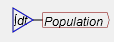

To model population, you need to include a growth rate. According to
Wikipedia, the current US population growth rate is `0.97` percent per
annum.  Expressed as an equation, this says that the annual change in
population, divided by its current level, equals `0.0097`:

*TODO: equation image*

To express this as an integral equation, firstly we multiply both
sides of this equation by `Population` to get:

*TODO: equation image*

Then we integrate both sides to get an equation that estimates what
the population will be `T` years into the future as:

*TODO: equation image*

Here, `315` (million) equals the current population of the USA, the year
zero is today, and `$T$` is some number of years from today. The same
equation done as a block diagram looks like this:

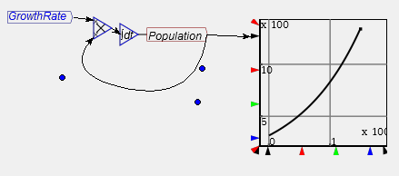

Or you can make it look more like the mathematical equation by
right-clicking on ``Population'' and choosing ``Copy Var''. Then you will
get another copy of the Population variable, and you can wire up the
equation this way:

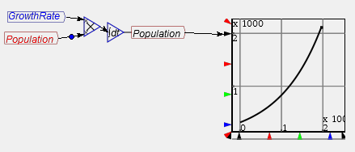

Either method can be used. I prefer the latter because it's neater,
and it emphasizes the link between the simple formula for a percentage
rate of change and a differential equation.

`Derivative Operator` This operator symbolically differentiates its input,
provided the input is differentiable. An error is generated if the input
is not differentiable.

`Plus, Minus, Multiply and Divide blocks`
. These execute the stated binary
mathematical operations. Each input can take multiple wires as
well---so that to add five numbers together, for example you can wire 1 input
to one port on the Add block, and the other four to the other
port.

`Min & Max Functions` These take the minimum and maximum values, respectively.
These also allow multiple wires per input.

`Power and Logarithm` These are binary operations (taking two
arguments). In the case of the power operation, the exponent is the
top port, and the argument to be raised to that exponent is the bottom
port. This is indicated by the `$x$` and `$y$` labels on the ports. In the
case of logarithm, the bottom port (labelled `$b$`) is the base of the
logarithm.

*Logical Operators*
- `<`
- `<=`
- `=`
- `&&` and
- `||` or
- `!` not

These return `0` for `false` and `1` for `true`.  In which may be
generated outside of Minsky, and imported as a CSV file.

`Other functions` These are a fairly standard
complement of mathematical functions.

`Data block` A data block interpolates a sequence of empirical values. This effectively defines a piecewise linear function.

`Plot widget` Add plots to the canvas.

`Switch` Add a piecewise-defined function block
to the canvas. Also known as a hybrid function.

`Notes` Add textual annotations

### Design Canvas
The `Design Canvas` is where you develop your model. A model consists of
a number of blocks---variables, constants and mathematical
operators---connected by wires.

The wires in a model connect blocks together to define equations. For
example, to write an equation for 100/33, you would place a
\smhtmladdimg{NewItem121.png} on the canvas, and give it the value of 100:

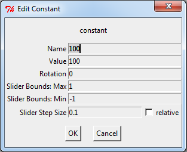

Then do the same for 33, and place a divide block on the canvas:

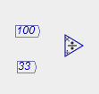

Then click on the right hand edge of 
and drag to extend the wire to the numerator (x) port of the divide operation.

## Working with Minsky

### Components in Minsky
There are a number of types of components in Minsky:
- `Mathematical operators` such as plus `+`, minus `-`
- `Constants` (or parameters) which are given a value by the user
- `Variables` whose values are calculated by the program during a simulation and depend on the values of constants and other variables; and
- `Godley Tables`, which define both financial accounts and the
flows between them.
- `Integrals` represent a variable computed by integrating a
function forward in time.

### Inserting a model component
There are three ways to insert a component of a model onto the Canvas:

Click on the desired `Icon` on the `Icon Palette`, drag the block
onto the Canvas and release the mouse where you want to insert it

Choose `Insert` from the menu and select the desired block there

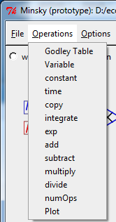

`Right-click` on an existing block and choose copy. Then place the
copy where you want it on the palette.

### Creating an equation
Equations are entered in Minsky graphically. Mathematical operations
like addition, multiplication and subtraction are performed by wiring
the inputs up to the relevant mathematical block. The output of the
block is then the result of the equation.

For example, a simple equation like

        100/3 = 33.3

is performed in Minsky by defining a constant block with a value of 100, defining another with a value of 3, and wiring them up to a divide-by block. Then attach the output of the divide block to a variable, and run the model by clicking on  :

If you choose `File/Output LaTeX` and load the equation into a LaTeX processor, you will see that it is:

*TODO: equation*

Very complex equations---including dynamic elements like integral
blocks and Godley Tables---are designed by wiring up lots of
components, with the output of one being the input of the next. See
the tutorial for examples.

### Wiring components together
A model is constructed by wiring one component to another in a way
that defines an equation. Wires are drawn from the output port of one
block to the input port of another. Ports are circles on the blocks to
which wires can be attached, which can be seen when hovering the
pointer over the block. Variables have an input and an output
port; constants and parameters only have an output port. A
mathematical operator has as many input ports as are needed to define
the operation.

To construct an equation, such as `Fred - Wilma = Barney`:

Click the mouse near the output port of one block and drag the
cursor to the input port of another while holding the mouse button
down.

Release the mouse button near the required input port of the operator.

The equation is completed by wiring up the other components in the same way.

## Creating a banking model}

### Creating a bank
The first step in creating a model with a banking sector is to click on the Godley Table Icon in the Icon Palette, and place the block somewhere on the Canvas:

### Entering accounts
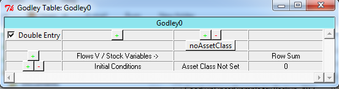

Double click or right click on the  block
to bring up the Godley Table:

When a Godley Table is first loaded, it has room for one account to be
defined. To create an additional account, click on the
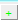 button above the first account. One
click then adds another column in which an additional account can be
defined.

A column can be deleted by clicking on the 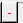button above the column.

To define bank accounts in the system you enter a name into the row
labeled `\verb+Flows V / Stock Variables ->+`. For example, if you were
going to define a banking sector that operated simply as an
intermediary between ``Patient'' people and `Impatient` people---as
in the Neoclassical `Loanable Funds` model--you might define the
following accounts:

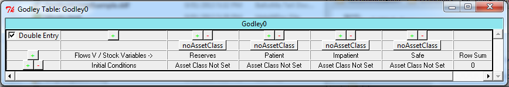

As you enter the accounts, they appear at the bottom of the `Bank` block on the canvas:

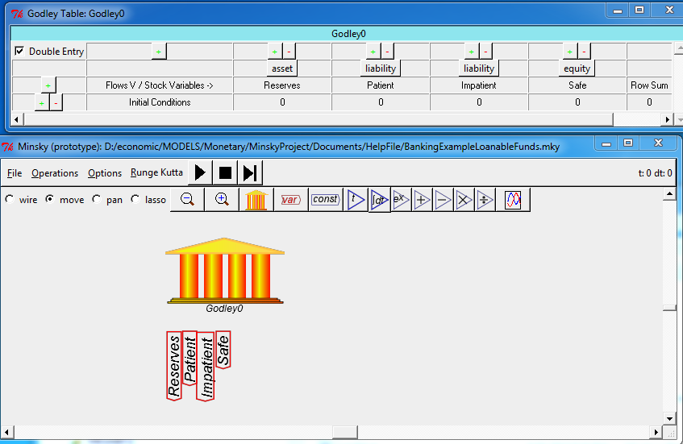

### Defining account types
Bank accounts must be classified as either an Asset, a Liability, or
the Equity of the relevant Bank, using the drop-down menu currently
labeled \smhtmladdimg{NewItem139.png} at the top of each account. In
this model, Reserves are an Asset of the banking sector, the accounts
of ``Patient'' and ``Impatient'' are liabilities, and the ``Safe'' is
the Equity of the banking system. Click on the
\smhtmladdimg{NewItem139.png} button and this drop-down menu will
appear:

Choose the relevant entry for each column, and the accounts will be properly classified when the model is simulated:

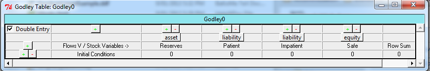

### Entering flows between accounts
Flows between accounts are entered by typing text labels in the
accounts involved. The source label is entered as a simple name, for
example, if `Patient` is lending money to Impatient, the word `Lend`
could be used to describe this action. Firstly you need to create a
row beneath the `Initial Conditions` row (which records the amount of
money in each account when the simulation begins). You do this by
clicking on the 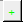 key on the `Initial Conditions` row. This creates a blank row for recording a flow between accounts.

The cell below `Initial Conditions` is used to give a verbal
description of what the flow is:

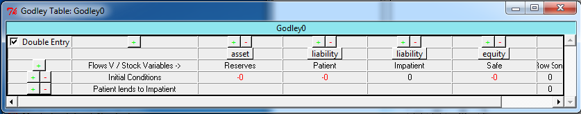

The flows between accounts are then recorded in the relevant cells
underneath the columns. Here we will start with putting the label
``Lend'' into the Patient column.

Notice that the program shows that the `Row Sum` for this transaction is
currently `Lend`, when it should be zero to obey the double-entry
bookkeeping rule that all rows must sum to zero. This is because a
destination for `Lend` has not yet been specified. The destination
is Impatient's account, and to balance the row to zero this part of
the transaction must be entered as `-Lend`:

This might appear strange if you are not used to accounting
standards.

    "Shouldn't the Patient account fall because of the loan,
    while the Impatient account should rise?"

What is shown in the table makes sense, because all accounts are perceived from the Bank's
point of view. Deposits at a bank are liabilities for the bank, and
are shown as a negative amount, while assets are recorded as a
positive amount. So a loan from `Patient` to `Impatient` decreases the
`Bank`'s liabilities to `Patient`, and increases the Bank's liabilities to
`Impatient`.

The same rule applies to the `Initial Conditions` (the amount of money
in each of the accounts prior to the flows between accounts): the
`Initial Conditions` must sum to zero. This requires that there are
entries on the Asset side of the `Banking ledger` that exactly match the
sum of `Liabilities` and `Equity` (`Equity` is also shown as a negative in
double-entry bookkeeping):

As you enter flows, these appear on the left hand side of the bank block:

### Defining flows}
The entries in the `Godley Table` represent flows of money, which are
denominated in money units per unit of time. The relevant time
dimension for an economic simulation is a year (whereas in engineering
applications, the relevant time dimension is a second), so whatever
you enter there represents a flow of money per year.

You define the value of flows by attaching a constant or variable to
the input side of the flow into the bank as shown on the Canvas. For
example, you could assign Lend a value of `10` (which would represent a
loan of `$10` per year by `Patient` to `Impatient`) by:

Creating a constant called `10`, with a value of `10`:

And attaching this to the input side of `Lend`:

What you have now defined is an annual flow from `Patient` to `Impatient`
of `$10`. In the dynamic equations this model generates, Minsky
converts all amounts in accounts to positive sums. It shows the
financial system from the point of the overall economy, rather than
from the point of view of the bank:

*TODO: equation image*

If you attach a graph to the accounts at the bottom of the bank block,
you will see the impact of this flow over time on the balances of the
two accounts. `Patient`'s account begins at `$100` and falls at `$10` per
year, while `Patient`'s account begins at `$0` and rises by `$10` per
year.

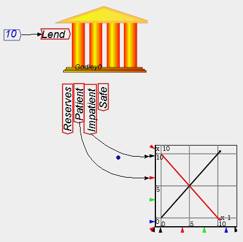

Obviously this will result in a negative total worth for `Patient` after
`10` years, so it is not a realistic model. A more sensible simple model
would relate lending to the amount left in `Patient`'s account (and a
more complex model would relate this to many other variables in the
model). That is done in the next example, where a constant `lendrate`
has been defined and given the value of `0.1`, and Lend is now defined
as `0.1` times the balance in `Patient`'s account. This now results in a
smooth exponential decay of the amount in the `Patient` account, matched
by a rise in the amount in Impatient account.

This is because the equation you have defined is identical to a
radioactive decay equation, with the amount in the `Patient` account
falling at `10` percent per year:

*TODO: equation image*

Note however that there are now wires crossing over other wires? There
is a neater way to define flows.

### Copying Godley Table input & outputs

Right-click on the inputs and outputs of a Godley Table and choose
`copy` from the drop-down menu:

Place the copied flows and accounts and place them away from the
table. Then wire up your definition there:

This now results in a much neater model. The same process can be used
to tidy up graphs as well:

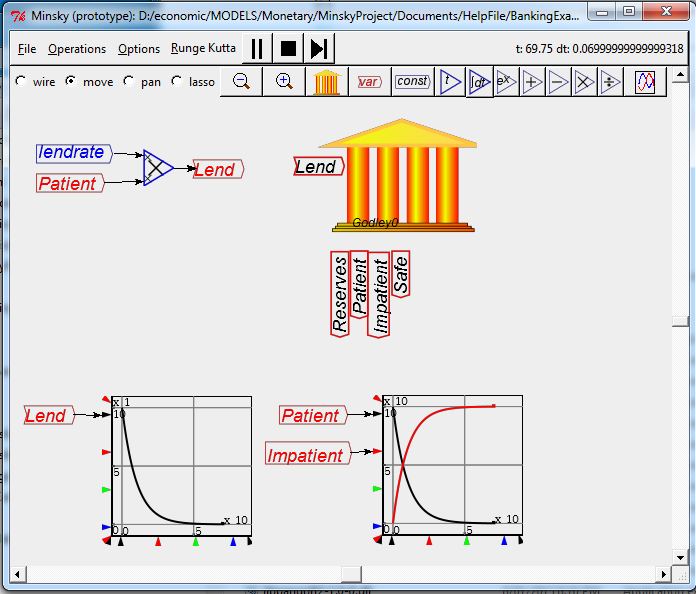

A more complex model would have many more flows, and these in turn
would depend on other entities in the model, and be time-varying
rather than using a constant `lendrate` as in this example.

See the Tutorial on a `Basic Banking Model` for an example.
This example uses the engineering concept of a `time constant`, which is explained in the next section.

Using `Time Constants`

The value of `0.1` means that the amount of money in the `Patient` account
falls by one tenth every year (and therefore tapers towards zero). An
equivalent way to express this is that the `time constant` for
lending is the inverse of `1/10`, or ten years. The next model uses a
variable called `tau_Lend`, and gives it a value of `10`:

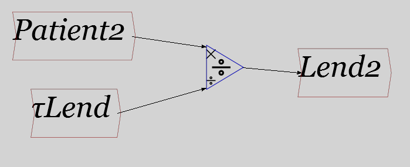

As the simulation shows, the two models have precisely the same result
numerically:

The advantage of the time constant approach is that it is defined in
terms of the time that a process takes. A time constant of 10 says
that, if this rate of lending was sustained (rather than declining as
the account falls), then in {\bf\em precisely} 10 years, the Patient account
would be empty. The advantages of this formulation will be more
obvious in the \htmlref{tutorial}{tutorial}.

### Multiple banks
There can be any number of Godley Tables, each representing a
different financial institution or sector in an economy, in the one
diagram. The name of the institution can be altered by clicking on the
default name (`Godley0` in the first one created) and altering
it. Here is an example with 4 such institutions/sectors defined:

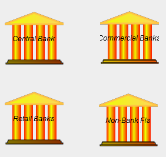

If there are interlocking accounts in these banks. If one lends to
another for example, then what is an asset for one must be shown as a
liability for the other.
