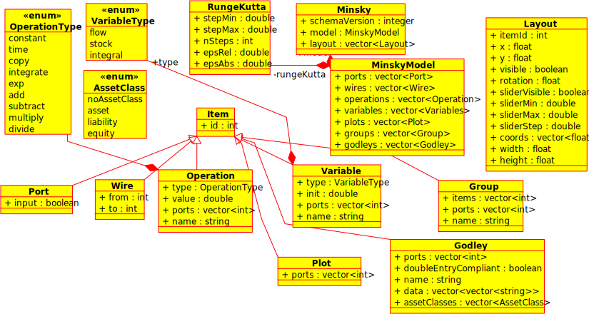
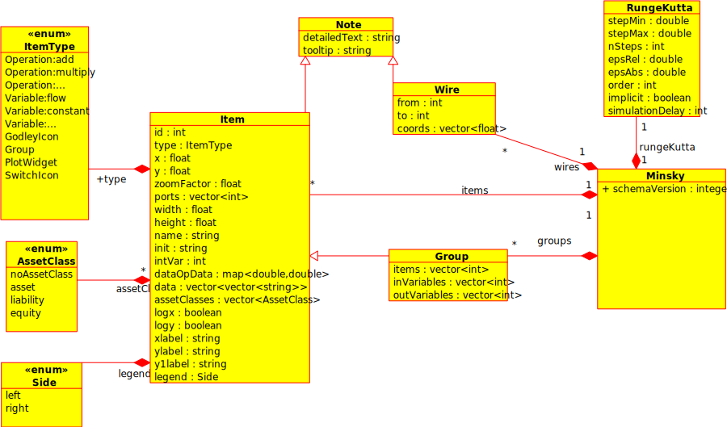

The format for the Minksy file (.mky extension) is documented as an XML schema at <http://minsky.sf.net/minsky.xsd>. The schema version used by Minsky 1.x is 1, and Minsky 2.x is 2, thus the schema version is currently tracking the Minsky version. This will not always be the case, however, but if the schema version is bumped, then so will the Minsky version. The script [exportSchema.tcl](exportSchema.tcl]) may be used to generate the schema files for any supported version, whch can be used with linting tools such as xmllint to validate any files you might generate.

A UML representation of schema 1: .

A UML representation of schema 2: .

By following this schema, you can create other tools that can interact with Minsky.

The definitive schema definition can be found in the header files in the [schema directory](../schema).

Notes:

* Minsky does not care what order elements are presented in, although schema validators (eg xmllint) do

* Minsky does not care if elements are missing (it substitutes default values), and ignores additional elements

* Leading and trailing whitespace on element fields are trimmed.

* If an element is missing, but an attribute of the same name is present, the Minsky will use that. So the following two code snippets are handled identically:

~~~~~~~~~~~~~~~~
    <Minsky schemaVersion="1">
    </Minsky>
~~~~~~~~~~~~~~~~
------------
~~~~~~~~~~~~~~~~
    <Minsky>
      <schemaVersion>1</schemaVersion>
    </Minsky>
~~~~~~~~~~~~~~~~

* Each item has a mandatory numerical id that allows other elements to refer to it. For example, items contain a list of port Ids, which wires use to refer to their from and to ports. Groups contain a list of item ids, which may also include other groups in a nested fashion. In schema 1, a group's port list is used to determine the I/O variables - in schema 2, groups now have explicit input and output variable lists. However, the port list of a Godley table is used to map the variables in a Godley table - if no port information is provided, new variables are created by the Godley table.

* The Schema 1 Layout vector contains optional visual layout information, so tools that do not care about layout can ignore this. In the fullness of time, Minsky will provide an auto-layout functionality to allow the import of Minsky files with partial, or even no layout information. In Schema 2, the layout information is incorporated into the items and wires themselves, but are entirely optional fields.

* The layout vector elements have entirely optional elements, except for the one mandatory element id, which refers to the id of the minskyModel element the layout element is describing. 

# Schema Evolution
Each schema is specified in a header file in the [schema subdirectory](../schema), and has an attribute indicating the version number. On read in, this can be used to determine which schema version Minsky object to use to read in the data. Each schema version is responsible for being able to convert the previous schema object into it's own format, allowing ongoing migration. This is handled in the Minsky::load method.
~~~~~~~~~~~~~~~~~~
    schema2::Minsky currentSchema;
    xml_unpack_t saveFile(inf);
    xml_unpack(saveFile, "Minsky", currentSchema);

    switch (currentSchema.schemaVersion)
      {
      case 0:
        {
          schema0::Minsky schema0;
          xml_unpack(saveFile, "root", schema0);
          *this=schema2::Minsky(schema1::Minsky(schema0));
          break;
        }
      case 1:
        {
          schema1::Minsky schema1;
          xml_unpack(saveFile, "Minsky", schema1);
          *this=schema2::Minsky(schema1);
          break;
        }
      case 2:
        *this = currentSchema;
        break;
      default:
        throw error("Minsky schema version %d not supported",currentSchema.schemaVersion);
      }
~~~~~~~~~~~~~~~
